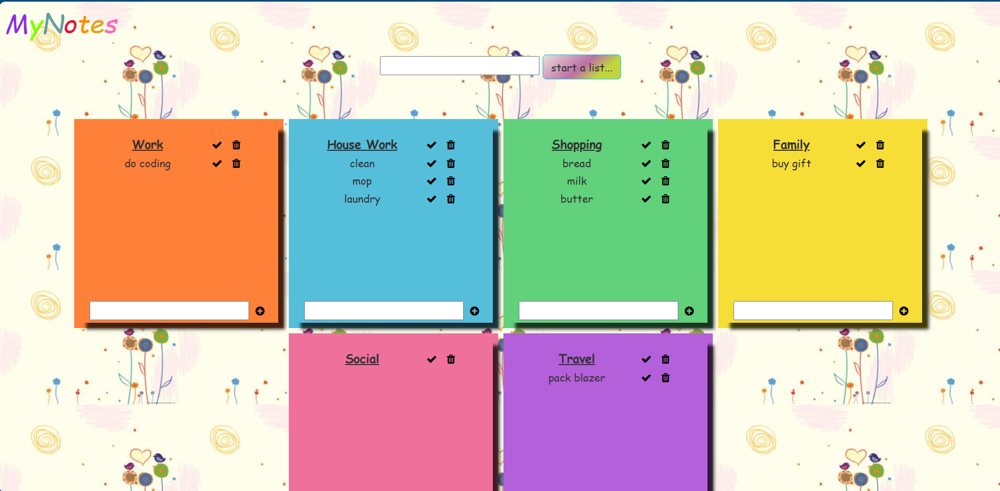
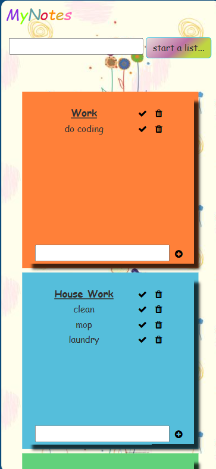

# Notes App

## Demo & Snippets

## Requirements / Purpose

- App that can create a sticky note with a list of items.
- Should be able to update, delete and create lists and items in each list

## Tech Stack

- Django
- SQLite
- Python

## Design Goals / Approach

The purpose of this project to build a web app in django framework.

## Features

- Adds a new list
- Deletes and updates an existing list
- Add new items to a list
- Updates and deletes an existing item in a list
- Responsive design
